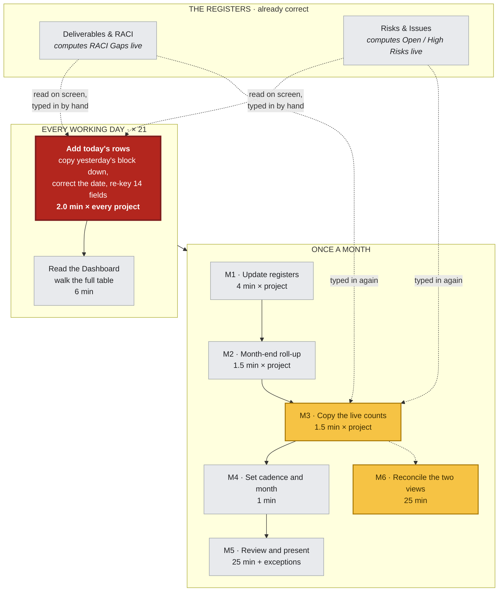
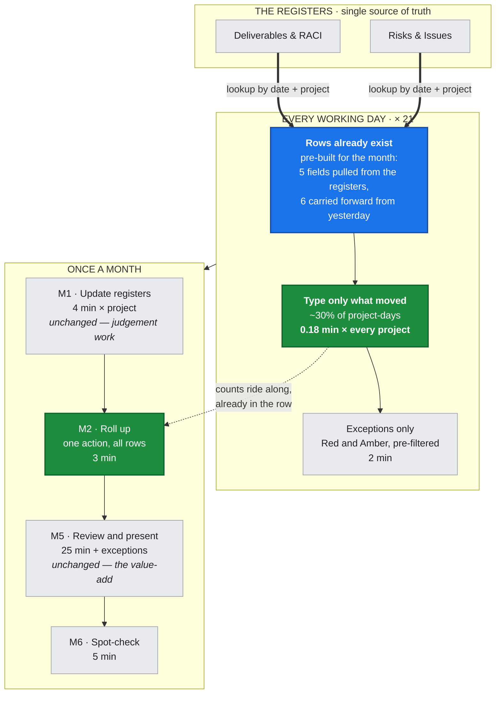

# TOR Reporting Workflow — bottleneck removal

The reporting cycle in `project-strategy-tor-dashboard/` costs **19.4 hours of analyst
time a month** at a 20-project portfolio. Three quarters of that is one step. This chart
shows which step, why it is the constraint, and what the workflow looks like once it is
gone: **4 hours a month, a 79.7% reduction** — rising past 80% at 25 projects or more.

Every figure comes from `workflow_time_model.py`. Change an assumption there and the
numbers here move with it.

---

## 1. As-is — where the time goes



| | Minutes / month | Share |
|---|---:|---:|
| **Daily Log data entry** | **840** | **72%** |
| Daily dashboard read | 126 | 11% |
| M1 Update registers | 80 | 7% |
| M5 Review and present | 31 | 3% |
| M2 Month-end roll-up | 30 | 3% |
| M3 Copy live register counts | 30 | 3% |
| M6 Reconcile the two views | 25 | 2% |
| M4 Set cadence and month | 1 | 0% |
| **Total** | **1,163 min · 19.4 h** | |

---

## 2. The bottleneck

**Daily Log data entry — 840 of 1,163 minutes.**

It is not the number of steps that makes it the constraint, it is the multiplier: it is
the only step that runs *per project × per working day*. At 20 projects that is 420 rows
and **5,880 hand-entered fields a month**.

The reason it is worth attacking is what those fields contain:

| Of the 14 fields in a Daily Log row | Fields | Per month | Where it already exists |
|---|---:|---:|---|
| Computed live by the registers | 5 | 2,100 | `Risks & Issues` and `Deliverables & RACI` compute these under headers that literally read *"→ copy to log"* |
| Unchanged since yesterday | 6 | 1,764 | The row directly above it |
| Genuinely new information | 3 | 2,016 | The analyst's head — irreducible |

**66% of the typing is a human hand-carrying data that the same workbook has already
calculated**, one sheet away. The re-keying is also where the errors enter, which is what
M6 spends 25 minutes a month reconciling.

> **Why fixing anything else does not work.** Delete M2, M3, M4 and M6 *entirely* — four
> whole steps, every monthly task short of the registers and the review — and the month
> still costs 17.9 of its 19.4 hours. **A 7.4% saving for deleting half the monthly
> cycle.** The constraint sets the pace; effort spent anywhere else is invisible.

---

## 3. To-be — the same workflow with the constraint removed



**M3 and M4 are gone from the chart.** M3 disappears because the register counts are in
the row before month-end arrives — there is nothing left to copy. M4 disappears because
the Dashboard defaults to the current period.

### The four changes

| # | Change | Step | Saves |
|---|---|---|---:|
| 1 | **Register lookup.** `Dl Due`, `Dl Accepted`, `Open Risks`, `High Risks`, `RACI Gaps` become an `INDEX/MATCH` on date + project, the same pattern the roll-up block already uses. | D1 | 231 min |
| 2 | **Carry-forward default.** Pre-build the month's rows; each remaining cell defaults to the day above unless overtyped. Blue text still means *safe to edit*. | D1 | 534 min |
| 3 | **One-action roll-up.** The roll-up block exists — extend it to all rows and paste values once. | M2, M3 | 57 min |
| 4 | **Exception-first views.** Daily read and Dashboard open on Red and Amber only. | D2, M4, M6 | 105 min |

Change 2 saves the most minutes. Change 1 matters most for correctness: once the counts
are looked up rather than typed, the log and the registers *cannot* disagree — which is
the entire reason M6 existed. The four sum to 927 minutes, the whole of the saving.

---

## 4. Result

| | As-is | To-be | Saved |
|---|---:|---:|---:|
| Daily Log data entry | 840 min | 75 min | **−91%** |
| Daily dashboard read | 126 min | 42 min | −67% |
| M1 Update registers | 80 min | 80 min | — |
| M2 Month-end roll-up | 30 min | 3 min | −90% |
| M3 Copy live register counts | 30 min | 0 min | **−100%** |
| M4 Set cadence and month | 1 min | 0 min | −100% |
| M5 Review and present | 31 min | 31 min | — |
| M6 Reconcile the two views | 25 min | 5 min | −80% |
| **Month total** | **19.4 h** | **3.9 h** | **−79.7%** |

Two rows are deliberately flat. **M1** is risk scoring and ownership; **M5** is the review
the whole pack exists to support. Automating judgement is how a reporting pack starts
producing confident nonsense — the target was never "less thinking", it was "less typing".

### Where the 80% holds

The target is a function of portfolio size, because the fixed-cost steps do not shrink:

| Projects | As-is | To-be | Reduction |
|---:|---:|---:|---:|
| 5 | 7.1 h | 1.9 h | 73.3% |
| 10 | 11.2 h | 2.6 h | 77.0% |
| 15 | 15.3 h | 3.3 h | 78.7% |
| 20 | 19.4 h | 3.9 h | 79.7% |
| **25** | 23.5 h | 4.6 h | **80.3%** |
| 30 | 27.6 h | 5.3 h | 80.8% |
| 40 | 35.8 h | 6.7 h | 81.4% |

**80% is reached at 25 projects and above.** At the 5-project scale of the shipped example
data it is 73% — still the largest single improvement available, but the honest number.
The saving is also sensitive to how much genuinely changes day to day: at a 20% daily
change rate the 20-project case reaches 81.6%; at 60% it falls to 74.0%.

### The constraint moves

Afterwards the largest remaining block is **M1, updating the registers — 34% of what is
left**. That is the correct place for it to land. It is the step where a human decides
what a risk is worth and who owns a deliverable, and the next 80% is not there to be had.

---

## 5. The chart as a page

`workflow_chart.html` is the same analysis as a standalone page — the two flows as inline
SVG, the two months drawn to the same scale so the reduction is visible rather than
asserted, and both sensitivity tables. No build step and no dependencies: open it in a
browser. It renders in light and dark, and its palette is the workbook's own colour
convention — blue for what you type, green for what is pulled from another sheet, and the
RAG the Dashboard already speaks in.

## 6. Reproducing these numbers

```bash
python3 workflow_time_model.py
```

No dependencies. Prints the per-step table at 5, 20 and 40 projects, the field-level
breakdown of what is being typed, and both sensitivity tables.

The as-is daily figure is anchored, not invented: the five components of `AS_IS_DAILY`
sum to 2.00 minutes per project per day, which is the figure the workbook's own Read Me
states for the daily routine.

## Scope

This is the analysis and the target-state chart. It does not modify
`Project_Strategy_TOR_Dashboard.xlsx` — implementing changes 1–4 in the generator is the
follow-on piece of work, and the table in §3 is its specification.
